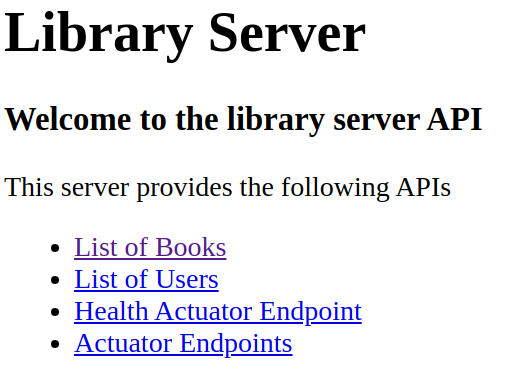

# Lab 1: Security via Spring Boot Auto-Configuration

In the first step we start quite easy by just adding the spring boot starter dependency for spring security.

**NOTE: Please start into the workshop using the project _lab1/library-server_**. 

## Add Dependencies

We just need to add the following two dependencies to the _build.gradle_ file of the initial application (_lab1/library-server_).

```yaml
dependencies {
    ...
	implementation 'org.springframework.boot:spring-boot-starter-security'
    ...
	testImplementation 'org.springframework.security:spring-security-test'
}
```
_build.gradle_

Please start the application by running the class _com.example.libraryserver.LibraryServerApplication_.

## Login

Spring Security 5 added a nicer auto-generated login form (build with bootstrap library).

   
_Autogenerated login formular_

If you browse to [localhost:9090/library](http://localhost:9090/library) then you will notice
that a login form appears in the browser window.

**TIP:**  But wait - what are the credentials for a user to log in?

With spring security auto-configured by spring boot the credentials are as follows:

* Username=__user__
* Password=__<Look into the console log!>__

```shell
INFO 18465 --- [  restartedMain] UserDetailsServiceAutoConfiguration :
Using default security password: ded10c78-0b2f-4ae8-89fe-c267f9a29e1d
```
_console log_

After giving the correct credentials you should see the main screen of the library application.

  
_main screen_

As you can see, if Spring Security is on the classpath,
then the web application is secured by default.
[Spring boot](https://docs.spring.io/spring-boot/docs/current/reference/htmlsingle/#boot-features-security) auto-configured
basic authentication and form based authentication for all web endpoints.

This also applies to all actuator endpoints like [localhost:9090/library/actuator/health](http://localhost:9090/library/actuator/health).
All monitoring web endpoints can now only be accessed with an authenticated user.
See [Actuator Security](https://docs.spring.io/spring-boot/docs/current/reference/htmlsingle/#boot-features-security-actuator)
for details.

Auto-generating the password on each application start is not really usable for serious applications.
Later we will use the persistent user data for login.
But for now Spring Security provides an easy way to set a static password using the _application.yml_ file:

```yaml
spring:
  application:
    name: library-server
  jpa:
    open-in-view: false
  jackson:
    default-property-inclusion: non_null
  security:
    user:
      password: secret
``` 
_application.yml_

To set the password to the value _secret_ just add the last 3 lines above to
the existing entries in the _application.yml_ file.

After restarting the application you can now login using _user/secret_.

## Common Security Problems

Additionally spring security improved the security of the web application automatically for:

* [Session Fixation](https://docs.spring.io/spring-security/site/docs/current/reference/htmlsingle/#ns-session-fixation):
Session Fixation is an attack that permits an attacker to hijack a valid user session. +
If you want to learn more about this please read the [Session Fixation page at OWASP](https://owasp.org/www-project-cheat-sheets/cheatsheets/Session_Management_Cheat_Sheet)
* [Cross Site Request Forgery (CSRF)](https://docs.spring.io/spring-security/site/docs/current/reference/htmlsingle/#csrf):
Cross-Site Request Forgery (CSRF) is an attack that forces an end user to execute unwanted actions on a web application in which they're currently authenticated. +
If you want to know what CSRF really is and how to mitigate this attack please consult [CSRF attack description at OWASP](https://owasp.org/www-project-cheat-sheets/cheatsheets/Cross-Site_Request_Forgery_Prevention_Cheat_Sheet)

* [Default Security Headers](https://docs.spring.io/spring-security/site/docs/current/reference/htmlsingle/#default-security-headers):
This automatically adds all recommended security response headers to all http responses. You can find more information about this topic in the [OWASP Secure Headers Project](https://owasp.org/www-project-secure-headers/)

```http
Cache-Control: no-cache, no-store, max-age=0, must-revalidate
Expires: 0
Pragma: no-cache
Referrer-Policy: no-referrer
X-Content-Type-Options: nosniff
X-Frame-Options: DENY
X-XSS-Protection: 1 ; mode=block
```
_default security response headers_

You can check the response headers configuration on [Security Headers](https://securityheaders.com/).

   

## Logout

Spring security 5 also added a bit more user friendly logout functionality out of the box.
If you direct your browser to [localhost:9090/library/logout](http://localhost:9090/library/logout) you will see the following
dialog on the screen.

   
_Autogenerated logout formular_

This concludes the first step.

**NOTE:** You find the completed code in project _lab1/library-server-complete_.

Now let's proceed to next step and start with customizing the authentication part.
