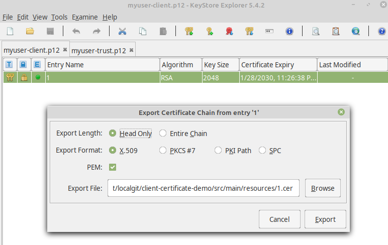

# Lab 4: Securing Microservices with Mutual TLS

## System Requirements

For this lab you need the following requirements:

* [mkcert](https://mkcert.dev/) to create trusted certificates for localhost. Please follow 
  the [installation instructions](https://github.com/FiloSottile/mkcert#installation) to set this up
  on your machine.
* [Keystore Explorer](https://keystore-explorer.org/) to manage keystore contents. To install it just 
  go to the [Keystore Downloads](https://keystore-explorer.org/downloads.html) page and get the appropriate
  installer for your operating system

## Setup a local Certificate Authority (CA)

To create a local certificate authority (with your own root certificate)
use the following command.
Make sure you also have set the _JAVA_HOME_ environment variable if you also want 
to install the root certificate into the trust store of your JDK. 

```shell script
export JAVA_HOME="$(dirname $(dirname $(readlink -f $(which java))))"
mkcert -install
```

This leads to an output similar to the following.

```shell script
Using the local CA at "/home/xxx/.local/share/mkcert" ✨
The local CA is installed in the system trust store! 👍
The local CA is installed in the Firefox and/or Chrome/Chromium trust store! 👍
Sudo password:xxxx
The local CA is now installed in Java's trust store! ☕️
```

## Setup HTTPS (SSL/TLS) for the application

At first you need a valid trusted server certificate.
To create a keystore containing the certificate with private/public key pair 
open a command line terminal then navigate to the subdirectory _src/main/resources_ of this project 
and use the following command.

```shell script
mkcert -p12-file server-keystore.p12 -pkcs12 localhost
```

This should lead to the following output:

```shell script
Created a new certificate valid for the following names
 - "localhost"

The PKCS#12 bundle is at "server-keystore.p12"

The legacy PKCS#12 encryption password is the often hardcoded default "changeit"
```

Now you should now find the newly created file _server-keystore.p12_ in the subdirectory _src/main/resources_.

To enable SSL/TLS in the spring boot application add the following entries to the _application.yml_ file:

```yaml
server:
  port: 9443  
  ssl:
    enabled: true
    key-store: classpath:server-keystore.p12
    key-store-type: PKCS12
    key-store-password: changeit
    key-password: changeit
```

Now (re-)start the application and navigate to [https://localhost:8443/library](https://localhost:8443/library).
You should recognize that the server application is now served using a secure Https connection.

## Setup the client certificate

First we need of course again a valid trusted client certificate to authenticate 
our client at the server.
Open a command line terminal again and navigate to subdirectory _src/main/resources_ of this project
and then use the following command.

```shell
mkcert -p12-file client-keystore.p12 -client -pkcs12 peter.parker@example.com
```

This should lead to the following output:

```shell
Created a new certificate valid for the following names
 - "peter.parker@example.com"

The PKCS#12 bundle is at "client-keystore.p12"

The legacy PKCS#12 encryption password is the often hardcoded default "changeit"
```

This file contains the client certificate including the private/public key pair.
To authenticate your web browser for our Spring Boot server application just import
the file _client-keystore.p12_ into the browsers certificate store.

But this is not sufficient, the server application also needs just the certificate (with public key)
to be able to validate the client certificate.
To achieve this we also need to configure a trust keystore for Spring Boot. 
You must not use the keystore we just created because the server should not get access to the private key.

Instead we have to create another keystore using the [Keystore Explorer](https://keystore-explorer.org/)
that only contains the certificate.

But first we have to export the certificate from the existing keystore _client-keystore.p12_:

1. Open keystore with the Keystore Explorer. Select _client-keystore.p12_ in file dialog.
2. Then right click on the single entry and select _Export/Export certificate chain_ and then use the 
   settings as shown in the figure below (export it to a file named _pparker.cer_).
   
   

Now we can import the exported single certificate into a new keystore.

1. Open the explorer and then create a new keystore using the menu _File/New_. 
2. Then chose _PKCS#12_ as type
3. Now select the menu _Tools/Import Trusted Certificate_
4. Select the exported file _pparker.cer_ from previous section and use _peter.parker@example.com_ as alias when asked
5. Save the keystore as _pparker-trust.p12_ and use password _changeit_ when prompted for

Now let's use this new keystore:

```yaml
server:
  ssl:
    trust-store: classpath:pparker-trust.p12
    trust-store-password: changeit
    client-auth: need
```

We need the trust store to enable trust between the server application and the client certificate in the web browser.
The property _client_auth_ specifies how mandatory the client certificate authentication is.
Possible values for this property are:

* __need__: The client certificate is mandatory for authentication
* __want__: The client certificate is requested but not mandatory for authentication
* __none__: The client certificate is not used at all

As final step we have to configure X509 client authentication in _com.example.libraryserver.config.WebSecurityConfiguration.java_:

```java
@Configuration
@EnableWebSecurity
public class WebSecurityConfiguration {

  // ...

  @Configuration
  public static class ApiWebSecurityConfigurationAdapter extends WebSecurityConfigurerAdapter {

    private final UserDetailsService userDetailsService;

    public ApiWebSecurityConfigurationAdapter(
        @Qualifier("library-user-details-service") UserDetailsService userDetailsService) {
      this.userDetailsService = userDetailsService;
    }

    @Override
    protected void configure(HttpSecurity http) throws Exception {
      http
          // ...
          .httpBasic(withDefaults())
          .formLogin(withDefaults())
          .x509(
              x -> {
                x.subjectPrincipalRegex("CN=(.*?),");
                x.userDetailsService(userDetailsService);
              });
    }
  }
}
```

The changes above 

* introduce a reference to the _UserDetailsService_ required for the X509 authentication
* configure how to get the principle from the client certificate using a regular expression for the common name (CN)

### Reference Documentation
For further reference, please consider the following sections:

* [Spring Security](https://docs.spring.io/spring-boot/docs/2.2.4.RELEASE/reference/htmlsingle/#boot-features-security)

### Guides
The following guides illustrate how to use some features concretely:

* [Securing a Web Application](https://spring.io/guides/gs/securing-web/)
* [Building a RESTful Web Service](https://spring.io/guides/gs/rest-service/)


