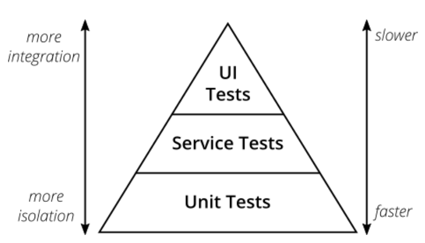
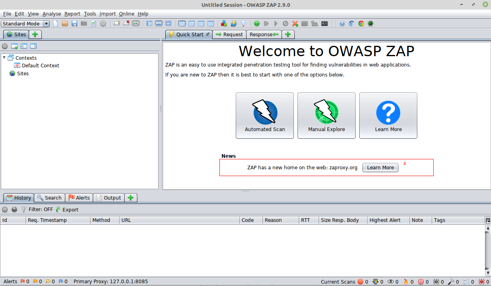
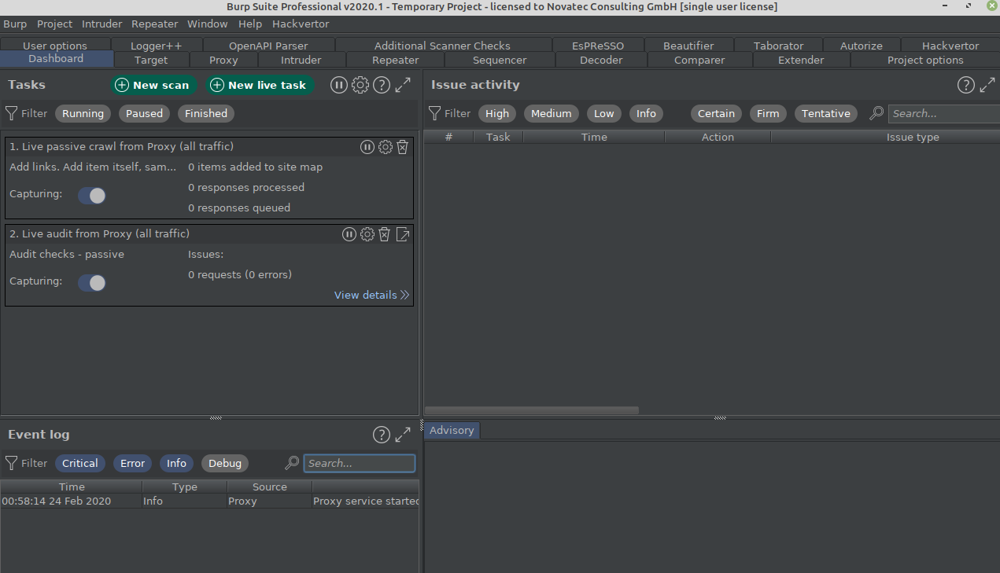

# Lab 5: Automated Security Testing

In this lab we will see how security can be tested as well.

Mike Cohn has defined the well-known testing pyramid.

   
_Testing Pyramid_

Just like any other business or technical facing test we can also test
security on each layer of the pyramid.

If you want to dive deeper in practical testing please check out
the [Practical Test Pyramid](https://martinfowler.com/articles/practical-test-pyramid.html) article by Martin Fowler.

## Unit Tests

We start with a simple unit test (using also mocking) to verify the correct functionality of our implementation
of the _UserDetailsService_ interface of Spring Security: The class _LibraryUserDetailsService_ as class under test (cut).

```java
package com.example.libraryserver.security;

import com.example.libraryserver.user.data.User;
import com.example.libraryserver.user.service.UserService;
import org.junit.jupiter.api.DisplayName;
import org.junit.jupiter.api.Test;
import org.junit.jupiter.api.extension.ExtendWith;
import org.mockito.InjectMocks;
import org.mockito.Mock;
import org.mockito.junit.jupiter.MockitoExtension;
import org.springframework.security.core.userdetails.UserDetails;
import org.springframework.security.core.userdetails.UsernameNotFoundException;

import java.util.Collections;
import java.util.Optional;

import static org.assertj.core.api.Assertions.assertThat;
import static org.assertj.core.api.Assertions.assertThatExceptionOfType;
import static org.mockito.ArgumentMatchers.any;
import static org.mockito.BDDMockito.given;

@DisplayName("Verify UserDetailsService")
@ExtendWith(MockitoExtension.class)
class LibraryUserDetailsServiceTest {

  @Mock private UserService userService;

  @InjectMocks private LibraryUserDetailsService cut;

  @DisplayName("can load existing user")
  @Test
  void loadUserByUsername() {
    given(userService.findOneByEmail(any()))
        .willReturn(
            Optional.of(
                new User(
                    "Hans", "Test", "test@example.com", "secret", Collections.singleton("USER"))));
    UserDetails userDetails = cut.loadUserByUsername("test@example.com");
    assertThat(userDetails).isNotNull().isInstanceOf(AuthenticatedUser.class);
  }

  @DisplayName("reports expected error when user does not exist")
  @Test
  void loadUserByUsernameNotFound() {
    given(userService.findOneByEmail(any())).willReturn(Optional.empty());
    assertThatExceptionOfType(UsernameNotFoundException.class)
        .isThrownBy(() -> cut.loadUserByUsername("test@example.com"))
        .withMessage("No user found for test@example.com")
        .withNoCause();
  }

  @DisplayName("can update password for existing user")
  @Test
  void updatePassword() {
    User user =
        new User("Hans", "Test", "test@example.com", "secret", Collections.singleton("USER"));
    UserDetails userDetails = new AuthenticatedUser(user);

    given(userService.findOneByEmail(any())).willReturn(Optional.of(user));
    given(userService.save(any()))
        .willReturn(
            new User(
                "Hans", "Test", "test@example.com", "newpassword", Collections.singleton("USER")));

    UserDetails result = cut.updatePassword(userDetails, "newpassword");
    assertThat(result)
        .isNotNull()
        .isInstanceOf(AuthenticatedUser.class)
        .extracting(UserDetails::getPassword)
        .isEqualTo("newpassword");
  }

  @DisplayName("reports expected error when password could not be updated")
  @Test
  void updatePasswordUsernameNotFound() {
    User user =
        new User("Hans", "Test", "test@example.com", "secret", Collections.singleton("USER"));
    UserDetails userDetails = new AuthenticatedUser(user);

    given(userService.findOneByEmail(any())).willReturn(Optional.empty());
    assertThatExceptionOfType(UsernameNotFoundException.class)
        .isThrownBy(() -> cut.updatePassword(userDetails, "newpassword"))
        .withMessage("No user found for test@example.com")
        .withNoCause();
  }
}
``` 
_LibraryUserDetailsServiceTest.java_

Here we have to test especially the two operations of loading a user and updating a user's password to use a better password encoding algorithm.

This test uses: 
* [JUnit5](https://junit.org/junit5/)
* [Mockito](https://site.mockito.org/)
* [AssertJ](https://assertj.github.io/doc/)

__Important:__ Always add negative test cases as well (i.e. what happens if no user has been found)!!

## Integration Tests

The next level are integration tests. Typical integration tests combine several classes and/or run inside a container like for example Spring.

### Testing Password Policies

We start with a very scoped integration test for verifying that the defined password policy is enforced as expected
by the _PasswordValidationService_ class.

```java
package com.example.libraryserver.security;

import com.example.libraryserver.config.PasswordValidationConfiguration;
import com.example.libraryserver.user.service.InvalidPasswordError;
import com.example.libraryserver.user.service.PasswordValidationService;
import org.junit.jupiter.api.DisplayName;
import org.junit.jupiter.api.Test;
import org.slf4j.Logger;
import org.slf4j.LoggerFactory;
import org.springframework.beans.factory.annotation.Autowired;
import org.springframework.boot.test.context.SpringBootTest;

import java.util.List;

import static org.assertj.core.api.Assertions.assertThat;
import static org.assertj.core.api.Assertions.catchThrowableOfType;

@DisplayName("Password validation")
@SpringBootTest(classes = PasswordValidationConfiguration.class)
public class PasswordValidationTest {

  private static final Logger LOGGER = LoggerFactory.getLogger(PasswordValidationTest.class);

  private final PasswordValidationService passwordValidationService;

  @Autowired
  public PasswordValidationTest(PasswordValidationService passwordValidationService) {
    this.passwordValidationService = passwordValidationService;
  }

  @Test
  @DisplayName("succeeds for valid password")
  void verifyValidPassword() {
    passwordValidationService.validate("user", "my!Secret4test");
  }

  @Test
  @DisplayName("succeeds for valid password with unicode character")
  void verifyValidPasswordWithUnicode() {
    String unicodePassword = "my!Secret4öest" + "\uD83D\uDE02\uD83D\uDE0D\uD83C\uDF89\uD83D\uDC4D";
    LOGGER.info("Password: {}", unicodePassword);
    passwordValidationService.validate("user", unicodePassword);
  }

  @Test
  @DisplayName("fails for too short password")
  void verifyInvalidPasswordTooShort() {
    InvalidPasswordError error =
        catchThrowableOfType(
            () -> passwordValidationService.validate("user", "my!Sec4test"),
            InvalidPasswordError.class);

    assertThat(error).isNotNull();

    List<String> messages = error.getValidationErrors();
    assertThat(messages.size()).isEqualTo(1);
    assertThat(messages.get(0)).isEqualTo("Password must be 12 or more characters in length.");
  }

  @Test
  @DisplayName("fails for too long password")
  void verifyInvalidPasswordTooLong() {

    InvalidPasswordError error =
        catchThrowableOfType(
            () ->
                passwordValidationService.validate(
                    "user", "my!Sec4testedfrewasdefvbnhjlkilomngthfargtwbnhjlmnhsömnöämnhjqpolwk"),
            InvalidPasswordError.class);

    assertThat(error).isNotNull();
    List<String> messages = error.getValidationErrors();
    assertThat(messages.size()).isEqualTo(1);
    assertThat(messages.get(0)).isEqualTo("Password must be no more than 64 characters in length.");
  }

  @Test
  @DisplayName("fails for too many repeating characters")
  void verifyInvalidPasswordTooManyRepeatingChars() {

    InvalidPasswordError error =
        catchThrowableOfType(
            () -> passwordValidationService.validate("user", "my!Sec4teeeest"),
            InvalidPasswordError.class);

    assertThat(error).isNotNull();

    List<String> messages = error.getValidationErrors();
    assertThat(messages.size()).isEqualTo(1);
    assertThat(messages.get(0)).isEqualTo("Password matches the illegal pattern 'eeee'.");
  }

  @Test
  @DisplayName("fails for username in password")
  void verifyInvalidPasswordUsernameInPassword() {

    InvalidPasswordError error =
        catchThrowableOfType(
            () -> passwordValidationService.validate("user", "my!Secret4tuser"),
            InvalidPasswordError.class);

    assertThat(error).isNotNull();

    List<String> messages = error.getValidationErrors();
    assertThat(messages.size()).isEqualTo(1);
    assertThat(messages.get(0)).isEqualTo("Password contains the user id 'user'.");
  }

  @Test
  @DisplayName("fails with expected multiple validation errors")
  void verifyInvalidPasswordMultipleErrors() {

    InvalidPasswordError error =
        catchThrowableOfType(
            () -> passwordValidationService.validate("user", "qwertyuser"),
            InvalidPasswordError.class);

    assertThat(error).isNotNull();

    List<String> messages = error.getValidationErrors();
    assertThat(messages.size()).isEqualTo(7);
    assertThat(messages)
        .containsExactlyInAnyOrder(
            "Password must be 12 or more characters in length.",
            "Password must contain 1 or more uppercase characters.",
            "Password must contain 1 or more digit characters.",
            "Password must contain 1 or more special characters.",
            "Password matches 1 of 4 character rules, but 3 are required.",
            "Password contains the user id 'user'.",
            "Password contains the dictionary word 'qwerty'.");
  }
}
```

Here we also verify the positive standard use cases and the negative ones as well.
We could have done this test as a unit test as well but the _PasswordValidationService_ is not well designed for
unit testing as it requires calling a _@PostConstruct_ method by the Spring lifecycle.

Practices like Test Driven Design (TDD) and Refactoring improve code design by specifying e.g. a unit test first and then 
writing just enough production code to make this test run green. This way we can achieve much better code design and architecture.

### Testing Authentication/Authorization for User on Web layer

Now we advance to authentication and authorization tests.
First we do the tests on web layer (the Rest API) for users.

```java
package com.example.libraryserver.user.web;

import com.example.libraryserver.DataInitializer;
import com.fasterxml.jackson.databind.ObjectMapper;
import org.junit.jupiter.api.BeforeEach;
import org.junit.jupiter.api.DisplayName;
import org.junit.jupiter.api.Nested;
import org.junit.jupiter.api.Test;
import org.junit.jupiter.api.extension.ExtendWith;
import org.springframework.beans.factory.annotation.Autowired;
import org.springframework.boot.test.context.SpringBootTest;
import org.springframework.http.MediaType;
import org.springframework.restdocs.RestDocumentationContextProvider;
import org.springframework.restdocs.RestDocumentationExtension;
import org.springframework.test.annotation.DirtiesContext;
import org.springframework.test.context.ActiveProfiles;
import org.springframework.test.context.junit.jupiter.SpringExtension;
import org.springframework.test.web.servlet.MockMvc;
import org.springframework.test.web.servlet.setup.MockMvcBuilders;
import org.springframework.web.context.WebApplicationContext;

import java.util.Collections;
import java.util.UUID;

import static org.hamcrest.Matchers.greaterThan;
import static org.hamcrest.Matchers.startsWith;
import static org.springframework.boot.test.context.SpringBootTest.WebEnvironment.MOCK;
import static org.springframework.restdocs.mockmvc.MockMvcRestDocumentation.document;
import static org.springframework.restdocs.mockmvc.MockMvcRestDocumentation.documentationConfiguration;
import static org.springframework.restdocs.operation.preprocess.Preprocessors.modifyUris;
import static org.springframework.restdocs.operation.preprocess.Preprocessors.prettyPrint;
import static org.springframework.security.test.web.servlet.request.SecurityMockMvcRequestPostProcessors.csrf;
import static org.springframework.security.test.web.servlet.request.SecurityMockMvcRequestPostProcessors.user;
import static org.springframework.security.test.web.servlet.setup.SecurityMockMvcConfigurers.springSecurity;
import static org.springframework.test.web.servlet.request.MockMvcRequestBuilders.delete;
import static org.springframework.test.web.servlet.request.MockMvcRequestBuilders.get;
import static org.springframework.test.web.servlet.request.MockMvcRequestBuilders.post;
import static org.springframework.test.web.servlet.request.MockMvcRequestBuilders.put;
import static org.springframework.test.web.servlet.result.MockMvcResultMatchers.content;
import static org.springframework.test.web.servlet.result.MockMvcResultMatchers.header;
import static org.springframework.test.web.servlet.result.MockMvcResultMatchers.jsonPath;
import static org.springframework.test.web.servlet.result.MockMvcResultMatchers.status;

@ExtendWith({SpringExtension.class, RestDocumentationExtension.class})
@SpringBootTest(webEnvironment = MOCK)
@DirtiesContext
@ActiveProfiles("test")
@DisplayName("Calling user rest api")
class UserRestControllerIntegrationTest {

  private final ObjectMapper objectMapper = new ObjectMapper();
  
  @Autowired private WebApplicationContext context;
  
  private MockMvc mvc;

  @BeforeEach
  void setup(RestDocumentationContextProvider restDocumentationContextProvider) {
    mvc =
        MockMvcBuilders.webAppContextSetup(context)
            .apply(springSecurity())
            .apply(
                documentationConfiguration(restDocumentationContextProvider)
                    .operationPreprocessors()
                    .withRequestDefaults(prettyPrint(), modifyUris().port(9090))
                    .withResponseDefaults(prettyPrint(), modifyUris().port(9090)))
            .build();
  }

  @Nested
  @DisplayName("succeeds")
  class PositiveTests {

    @Test
    @DisplayName("in registering a new user")
    void registerUser() throws Exception {
      CreateUserModel model =
          new CreateUserModel(
              "Hans",
              "Mustermann",
              "test@example.com",
              "MySecret4Test",
              Collections.singleton("USER"));
      mvc.perform(
              post("/users")
                  .contentType(MediaType.APPLICATION_JSON)
                  .content(objectMapper.writeValueAsString(model))
                  .with(csrf())
                  .with(user("user").roles("LIBRARY_ADMIN")))
          .andExpect(status().isCreated())
          .andExpect(header().exists("location"))
          .andExpect(jsonPath("$.identifier").exists())
          .andDo(document("create-user"));
    }

    @Test
    @DisplayName("in updating an existing user")
    void updateUser() throws Exception {
      CreateUserModel model =
          new CreateUserModel(
              "Hans",
              "Mustermann",
              "test@example.com",
              "MySecret4Test",
              Collections.singleton("LIBRARY_ADMIN"));
      mvc.perform(
              put("/users/{userIdentifier}", DataInitializer.ADMIN_IDENTIFIER)
                  .contentType(MediaType.APPLICATION_JSON)
                  .content(objectMapper.writeValueAsString(model))
                  .with(csrf())
                  .with(user("user").roles("LIBRARY_ADMIN")))
          .andExpect(status().isOk())
          .andExpect(jsonPath("$.lastName").value("Mustermann"))
          .andDo(document("update-user"));
    }

    @Test
    @DisplayName("in getting a list of all users")
    void listAllUsers() throws Exception {
      mvc.perform(get("/users").with(user("user").roles("LIBRARY_ADMIN")))
          .andExpect(status().isOk())
          .andExpect(jsonPath("$.users.length()").value(greaterThan(0)))
          .andDo(document("get-users"));
    }

    @Test
    @DisplayName("in getting a single user")
    void getSingleUser() throws Exception {
      mvc.perform(
              get("/users/{userIdentifier}", DataInitializer.WAYNE_USER_IDENTIFIER)
                  .with(user("user").roles("LIBRARY_ADMIN")))
          .andExpect(status().isOk())
          .andExpect(
              jsonPath("$.identifier").value(DataInitializer.WAYNE_USER_IDENTIFIER.toString()))
          .andExpect(jsonPath("$.lastName").value("Wayne"))
          .andDo(document("get-user"));
    }

    @Test
    @DisplayName("in deleting an user")
    void deleteUser() throws Exception {
      mvc.perform(
              delete("/users/{userIdentifier}", DataInitializer.CURATOR_IDENTIFIER)
                  .with(csrf())
                  .with(user("user").roles("LIBRARY_ADMIN")))
          .andExpect(status().isNoContent())
          .andDo(document("delete-user"));
    }
  }

  @Nested
  @DisplayName("fails")
  class NegativeTests {

    @Test
    @DisplayName("in registering a new user with invalid email")
    void registerUser() throws Exception {
      CreateUserModel model =
          new CreateUserModel(
              "Hans", "Mustermann", "example.com", "password", Collections.singleton("USER"));
      mvc.perform(
              post("/users")
                  .contentType(MediaType.APPLICATION_JSON)
                  .content(objectMapper.writeValueAsString(model))
                  .with(csrf())
                  .with(user("user").roles("LIBRARY_ADMIN")))
          .andExpect(status().isBadRequest())
          .andExpect(
              content()
                  .string(
                      startsWith(
                          "Field error in object \\'createUserModel\\' on field \\'email\\'")));
    }

    @Test
    @DisplayName("in updating an existing user with invalid email")
    void updateUser() throws Exception {
      CreateUserModel model =
          new CreateUserModel(
              "Hans",
              "Mustermann",
              "example.com",
              "password",
              Collections.singleton("LIBRARY_ADMIN"));
      mvc.perform(
              put("/users/{userIdentifier}", DataInitializer.ADMIN_IDENTIFIER)
                  .contentType(MediaType.APPLICATION_JSON)
                  .content(objectMapper.writeValueAsString(model))
                  .with(csrf())
                  .with(user("user").roles("LIBRARY_ADMIN")))
          .andExpect(status().isBadRequest())
          .andExpect(
              content()
                  .string(
                      startsWith(
                          "Field error in object \\'createUserModel\\' on field \\'email\\'")));
    }

    @Test
    @DisplayName("in getting an unknown user")
    void getSingleUser() throws Exception {
      mvc.perform(
              get("/users/{userIdentifier}", UUID.randomUUID())
                  .with(user("user").roles("LIBRARY_ADMIN")))
          .andExpect(status().isNotFound());
    }

    @Test
    @DisplayName("in deleting an unknown user")
    void deleteUser() throws Exception {
      mvc.perform(
              delete("/users/{userIdentifier}", UUID.randomUUID())
                  .with(csrf())
                  .with(user("user").roles("LIBRARY_ADMIN")))
          .andExpect(status().isNotFound());
    }
  }

  @Nested
  @DisplayName("fails with unauthorized")
  class AuthenticationTests {

    @Test
    @DisplayName("in registering a new user")
    void registerUserUnAuthorized() throws Exception {
      CreateUserModel model =
          new CreateUserModel(
              "Hans",
              "Mustermann",
              "test@example.com",
              "MySecret4Test",
              Collections.singleton("USER"));
      mvc.perform(
              post("/users")
                  .contentType(MediaType.APPLICATION_JSON)
                  .content(objectMapper.writeValueAsString(model))
                  .with(csrf()))
          .andExpect(status().isUnauthorized());
    }

    @Test
    @DisplayName("in updating an existing user")
    void updateUserUnAuthorized() throws Exception {
      CreateUserModel model =
          new CreateUserModel(
              "Hans",
              "Mustermann",
              "test@example.com",
              "MySecret4Test",
              Collections.singleton("LIBRARY_ADMIN"));
      mvc.perform(
              put("/users/{userIdentifier}", DataInitializer.ADMIN_IDENTIFIER)
                  .contentType(MediaType.APPLICATION_JSON)
                  .content(objectMapper.writeValueAsString(model))
                  .with(csrf()))
          .andExpect(status().isUnauthorized());
    }

    @Test
    @DisplayName("in getting a list of all users")
    void listAllUsersUnAuthorized() throws Exception {
      mvc.perform(get("/users")).andExpect(status().isUnauthorized());
    }

    @Test
    @DisplayName("in getting a single user")
    void getSingleUserUnAuthorized() throws Exception {
      mvc.perform(get("/users/{userIdentifier}", DataInitializer.WAYNE_USER_IDENTIFIER))
          .andExpect(status().isUnauthorized());
    }

    @Test
    @DisplayName("in deleting an user")
    void deleteUserUnAuthorized() throws Exception {
      mvc.perform(
              delete("/users/{userIdentifier}", DataInitializer.CURATOR_IDENTIFIER).with(csrf()))
          .andExpect(status().isUnauthorized());
    }
  }

  @DisplayName("fails for missing CSRF token")
  @Nested
  class CsrfTokenTests {

    @Test
    @DisplayName("in registering a new user")
    void registerUserNoCsrfToken() throws Exception {
      CreateUserModel model =
          new CreateUserModel(
              "Hans",
              "Mustermann",
              "test@example.com",
              "MySecret4Test",
              Collections.singleton("USER"));
      mvc.perform(
              post("/users")
                  .contentType(MediaType.APPLICATION_JSON)
                  .content(objectMapper.writeValueAsString(model))
                  .with(user("user").roles("LIBRARY_ADMIN")))
          .andExpect(status().isForbidden());
    }

    @Test
    @DisplayName("in updating an existing user")
    void updateUserNoCsrfToken() throws Exception {
      CreateUserModel model =
          new CreateUserModel(
              "Hans",
              "Mustermann",
              "test@example.com",
              "MySecret4Test",
              Collections.singleton("LIBRARY_ADMIN"));
      mvc.perform(
              put("/users/{userIdentifier}", DataInitializer.ADMIN_IDENTIFIER)
                  .contentType(MediaType.APPLICATION_JSON)
                  .content(objectMapper.writeValueAsString(model))
                  .with(user("user").roles("LIBRARY_ADMIN")))
          .andExpect(status().isForbidden());
    }

    @Test
    @DisplayName("in deleting an user")
    void deleteUserNoCsrfToken() throws Exception {
      mvc.perform(
              delete("/users/{userIdentifier}", DataInitializer.CURATOR_IDENTIFIER)
                  .with(user("user").roles("LIBRARY_ADMIN")))
          .andExpect(status().isForbidden());
    }
  }
}
```  
_UserRestControllerIntegrationTest.java_

Important part is here to configure spring security test filters for the Spring MVC tests in the setup operation by
adding the _apply(springSecurity())_ code part.

```java
class UserRestControllerIntegrationTest {

// ..

  @BeforeEach
  void setup(RestDocumentationContextProvider restDocumentationContextProvider) {
    mvc =
        MockMvcBuilders.webAppContextSetup(context)
            .apply(springSecurity())
            .apply(
                documentationConfiguration(restDocumentationContextProvider)
                    .operationPreprocessors()
                    .withRequestDefaults(prettyPrint(), modifyUris().port(9090))
                    .withResponseDefaults(prettyPrint(), modifyUris().port(9090)))
            .build();
  }
  // ...
}
``` 

For testing the authentication we just specify a user name with corresponding roles and verify if authentication works:

```java
.with(user("user").roles("LIBRARY_ADMIN"))
```

In addition to testing for authentication/authorization we can also test the CSRF protection by using

```java
.with(csrf())
```

Important again here again is to test for negative cases as well, e.g. for missing authentication or CSRF token.

## Testing Authorization for BookService on Method layer

Spring Security also supports fine-grained testing of your authorization permission model.
For this the annotation @WithMockUser is used to simulate a user with roles on method layer like in the _BookServiceAuthorizationIntegrationTest_:

```java
package com.example.libraryserver.book.service;

import com.example.libraryserver.book.data.Book;
import com.example.libraryserver.book.data.BookRepository;
import com.example.libraryserver.config.IdGeneratorConfiguration;
import com.example.libraryserver.security.AuthenticatedUser;
import com.example.libraryserver.user.data.User;
import com.example.libraryserver.user.data.UserRepository;
import org.junit.jupiter.api.DisplayName;
import org.junit.jupiter.api.Nested;
import org.junit.jupiter.api.Test;
import org.junit.jupiter.params.ParameterizedTest;
import org.junit.jupiter.params.provider.ValueSource;
import org.springframework.beans.factory.annotation.Autowired;
import org.springframework.boot.test.context.TestConfiguration;
import org.springframework.boot.test.mock.mockito.MockBean;
import org.springframework.context.annotation.Import;
import org.springframework.security.access.AccessDeniedException;
import org.springframework.security.authentication.TestingAuthenticationToken;
import org.springframework.security.authentication.UsernamePasswordAuthenticationToken;
import org.springframework.security.config.annotation.method.configuration.EnableGlobalMethodSecurity;
import org.springframework.security.core.authority.AuthorityUtils;
import org.springframework.security.test.context.TestSecurityContextHolder;
import org.springframework.security.test.context.support.WithMockUser;
import org.springframework.test.context.junit.jupiter.SpringJUnitConfig;

import java.util.Collections;
import java.util.UUID;

import static org.assertj.core.api.Assertions.assertThatExceptionOfType;

@DisplayName("Book service")
@SpringJUnitConfig(classes = BookServiceAuthorizationIntegrationTest.BookServiceConfig.class)
class BookServiceAuthorizationIntegrationTest {

  @Autowired private BookService cut;
  @MockBean private BookRepository bookRepository;
  @MockBean private UserRepository userRepository;

  private AuthenticatedUser getPrincipal() {
    return (AuthenticatedUser)
        TestSecurityContextHolder.getContext().getAuthentication().getPrincipal();
  }

  private void createAuthenticationContext(User expectedUser) {
    TestSecurityContextHolder.setAuthentication(
        new UsernamePasswordAuthenticationToken(
            new AuthenticatedUser(expectedUser),
            "secret",
            AuthorityUtils.commaSeparatedStringToAuthorityList("ROLE_LIBRARY_USER")));
  }

  private void createAuthenticationContext(String... roles) {
    TestSecurityContextHolder.setAuthentication(
        new TestingAuthenticationToken(
            new AuthenticatedUser(
                new User(
                    UUID.randomUUID(),
                    "Hans",
                    "Test",
                    "test@example.com",
                    "secret",
                    Collections.emptySet())),
            "secret",
            AuthorityUtils.createAuthorityList(roles)));
  }

  @TestConfiguration
  @EnableGlobalMethodSecurity(prePostEnabled = true)
  @Import({BookService.class, IdGeneratorConfiguration.class})
  static class BookServiceConfig {}

  @DisplayName("is authorized for")
  @WithMockUser
  @Nested
  class PositiveAuthorizationTests {

    @DisplayName("finding book by identifier")
    @Test
    void findOneByIdentifier() {
      cut.findOneByIdentifier(UUID.randomUUID());
    }

    @DisplayName("finding all books")
    @Test
    void findAll() {
      cut.findAll();
    }

    @DisplayName("saving a book")
    @WithMockUser(roles = "LIBRARY_CURATOR")
    @Test
    void verifySave() {
      cut.save(new Book("1234567890", "title", "desc", Collections.singleton("author")));
    }

    @DisplayName("borrowing a book")
    @Test
    void borrowForUser() {
      createAuthenticationContext("ROLE_LIBRARY_USER");
      cut.borrowForUser(UUID.randomUUID(), UUID.randomUUID(), getPrincipal());
    }

    @DisplayName("returning a borrowed book")
    @Test
    void returnForUser() {
      createAuthenticationContext("ROLE_LIBRARY_USER");
      cut.returnForUser(UUID.randomUUID(), UUID.randomUUID(), getPrincipal());
    }

    @DisplayName("deleting a book")
    @WithMockUser(roles = "LIBRARY_CURATOR")
    @Test
    void deleteOneByIdentifier() {
      cut.deleteOneByIdentifier(UUID.randomUUID());
    }
  }

  @DisplayName("is not authorized for")
  @Nested
  class NegativeAuthorizationTests {

    @DisplayName("saving a book with")
    @ParameterizedTest
    @ValueSource(strings = {"ROLE_LIBRARY_USER", "ROLE_LIBRARY_ADMIN", "ROLE_USER"})
    void verifySave(String role) {
      createAuthenticationContext(role);
      assertThatExceptionOfType(AccessDeniedException.class)
          .isThrownBy(
              () ->
                  cut.save(
                      new Book("1234567890", "title", "desc", Collections.singleton("author"))));
    }

    @DisplayName("borrowing a book with")
    @ParameterizedTest
    @ValueSource(strings = {"ROLE_LIBRARY_CURATOR", "ROLE_LIBRARY_ADMIN", "ROLE_USER"})
    void borrowForUser(String role) {
      createAuthenticationContext(role);
      assertThatExceptionOfType(AccessDeniedException.class)
          .isThrownBy(
              () -> cut.borrowForUser(UUID.randomUUID(), UUID.randomUUID(), getPrincipal()));
    }

    @DisplayName("returning a book with")
    @ParameterizedTest
    @ValueSource(strings = {"ROLE_LIBRARY_CURATOR", "ROLE_LIBRARY_ADMIN", "ROLE_USER"})
    void returnForUser(String role) {
      createAuthenticationContext(role);
      assertThatExceptionOfType(AccessDeniedException.class)
          .isThrownBy(
              () -> cut.returnForUser(UUID.randomUUID(), UUID.randomUUID(), getPrincipal()));
    }

    @DisplayName("deleting a book with")
    @ParameterizedTest
    @ValueSource(strings = {"ROLE_LIBRARY_USER", "ROLE_LIBRARY_ADMIN", "ROLE_USER"})
    void deleteOneByIdentifier(String role) {
      createAuthenticationContext(role);
      assertThatExceptionOfType(AccessDeniedException.class)
          .isThrownBy(() -> cut.deleteOneByIdentifier(UUID.randomUUID()));
    }
  }
}
```
_BookServiceAuthorizationIntegrationTest.java_

Here we also use positive and negative tests as JUnit5 nested and parameterized tests and the annotation _@WithMockUser(roles = "LIBRARY_CURATOR")_.

### Actuator Security

Please don't forget to test the security of the Spring Boot Actuator as well.
The actuator can provide very sensitive information like environment variables containing credentials or even an endpoint to shutdown the application.

Therefore it is important to add an _ActuatorIntegrationTest_:

```java
package com.example.libraryserver.actuator;

import org.junit.jupiter.api.BeforeEach;
import org.junit.jupiter.api.DisplayName;
import org.junit.jupiter.api.Nested;
import org.junit.jupiter.api.Test;
import org.junit.jupiter.api.extension.ExtendWith;
import org.springframework.beans.factory.annotation.Autowired;
import org.springframework.boot.test.context.SpringBootTest;
import org.springframework.test.annotation.DirtiesContext;
import org.springframework.test.context.ActiveProfiles;
import org.springframework.test.context.junit.jupiter.SpringExtension;
import org.springframework.test.web.servlet.MockMvc;
import org.springframework.test.web.servlet.setup.MockMvcBuilders;
import org.springframework.web.context.WebApplicationContext;

import static org.hamcrest.Matchers.greaterThan;
import static org.springframework.boot.test.context.SpringBootTest.WebEnvironment.MOCK;
import static org.springframework.security.test.web.servlet.request.SecurityMockMvcRequestPostProcessors.user;
import static org.springframework.security.test.web.servlet.setup.SecurityMockMvcConfigurers.springSecurity;
import static org.springframework.test.web.servlet.request.MockMvcRequestBuilders.get;
import static org.springframework.test.web.servlet.result.MockMvcResultMatchers.jsonPath;
import static org.springframework.test.web.servlet.result.MockMvcResultMatchers.status;

@ExtendWith(SpringExtension.class)
@SpringBootTest(webEnvironment = MOCK)
@DirtiesContext
@ActiveProfiles("test")
@DisplayName("Calling spring boot actuator")
class ActuatorIntegrationTest {

  @Autowired private WebApplicationContext context;

  private MockMvc mvc;

  @BeforeEach
  void setup() {
    mvc = MockMvcBuilders.webAppContextSetup(context).apply(springSecurity()).build();
  }

  @Nested
  @DisplayName("succeeds")
  class PositiveTests {

    @Test
    @DisplayName("for health endpoint without authentication")
    void health() throws Exception {

      mvc.perform(get("/actuator/health"))
          .andExpect(status().isOk())
          .andExpect(jsonPath("$.status").value("UP"))
          .andExpect(jsonPath("$.components").doesNotExist());
    }

    @Test
    @DisplayName("for health endpoint details with authentication")
    void healthWithAuth() throws Exception {

      mvc.perform(get("/actuator/health").with(user("user").roles("LIBRARY_ACTUATOR")))
          .andExpect(status().isOk())
          .andExpect(jsonPath("$.status").value("UP"))
          .andExpect(jsonPath("$.components").exists());
    }

    @Test
    @DisplayName("for info endpoint")
    void info() throws Exception {

      mvc.perform(get("/actuator/info"))
          .andExpect(status().isOk())
          .andExpect(jsonPath("$.application.name").value("library-server"));
    }

    @Test
    @DisplayName("for env endpoint")
    void env() throws Exception {

      mvc.perform(get("/actuator/env").with(user("user").roles("LIBRARY_ACTUATOR")))
          .andExpect(status().isOk())
          .andExpect(jsonPath("$.propertySources.length()").value(greaterThan(0)));
    }

    @Test
    @DisplayName("for metrics endpoint")
    void metrics() throws Exception {

      mvc.perform(get("/actuator/metrics").with(user("user").roles("LIBRARY_ACTUATOR")))
          .andExpect(status().isOk())
          .andExpect(jsonPath("$.names").exists());
    }
  }

  @Nested
  @DisplayName("fails")
  class NegativeTests {

    @Test
    @DisplayName("for env endpoint when user is not authenticated")
    void env() throws Exception {

      mvc.perform(get("/actuator/env")).andExpect(status().isUnauthorized());
    }

    @Test
    @DisplayName("for metrics endpoint when user is not authenticated")
    void metrics() throws Exception {

      mvc.perform(get("/actuator/metrics")).andExpect(status().isUnauthorized());
    }
  }
}
```
_ActuatorIntegrationTest.java_

There a even more tests in the reference solution in _lab5/library-server-complete_.

## Dynamic Security Testing (DAST)

A developer should change roles from time to time and become an _Ethical Hacker_ (an attacker just testing the own applications and not for 
illegal purposes).

You can use tools like:

* [OWASP Zap](https://www.zaproxy.org/)
* [Portswigger BurpSuite (Free Community Edition)](https://portswigger.net/burp/communitydownload)
* [Portswigger BurpSuite (Professional Commercial Edition)](https://portswigger.net/burp/pro)

All these tools act like a proxy between the client (the web browser) and the application.
OWASP Zap and BurpSuite Professional also include automated scanners (passive/active) for typical security attacks like SQL Injections
or XSS.

__WARNING:__ The active scanners of OWASP Zap and BurpSuite should only be used on web sites you have explicitly permission for as these
do perform real attacks on these web sites and can cause critical damage if security issues are found. So do NOT use it e.g. on google.de etc.!!!!

Finally both tools also have a fuzzing feature, so you can throw all kinds of data into all places for data input (like url paths, body data, etc.).
This is not only useful for security tests but also good for testing error handling of your Rest API.

   
_OWASP Zap_

   
_BurpSuite Professional_
 

